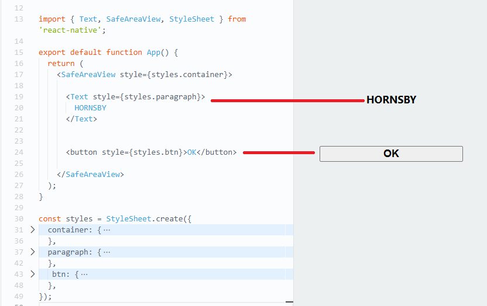
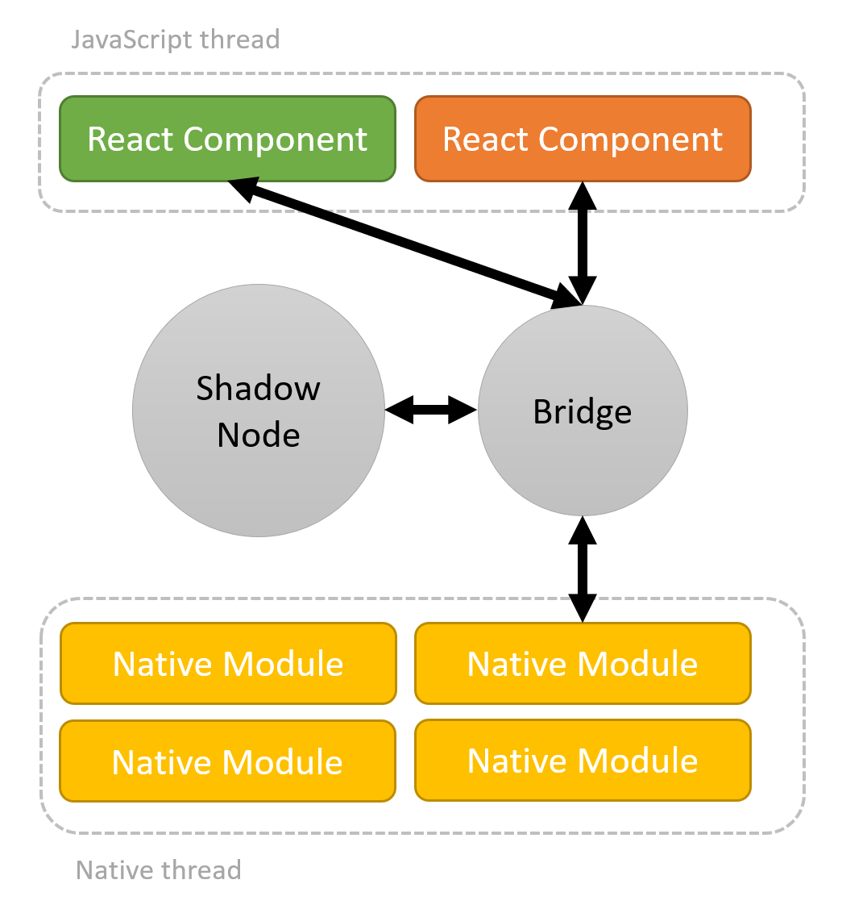
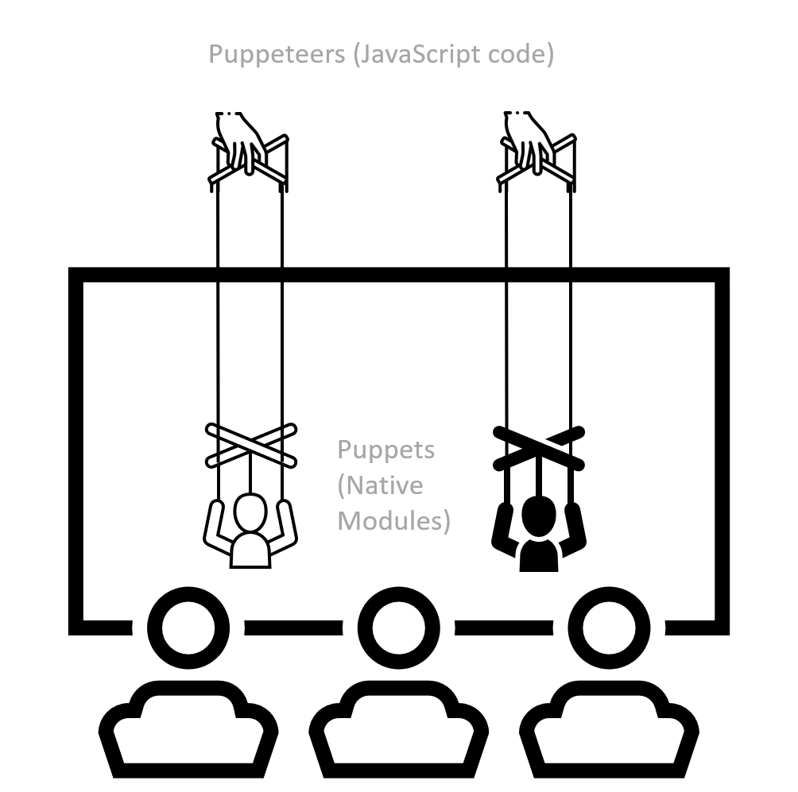

# React Native

## What is ReactJS

**ReactJS**, is an open-source JavaScript library for building user interfaces. It was developed by Facebook and is widely used for creating dynamic and interactive web applications. React allows developers to build reusable UI components that update efficiently when data changes, thanks to its virtual DOM (Document Object Model) rendering approach.

### Key Features of React

- **Component-based architecture**: UIs are broken down into reusable components.
- **Virtual DOM**: Efficiently updates the DOM, reducing unnecessary re-rendering.
- **JSX (JavaScript XML)**: A syntax extension that allows the mixing of JavaScript and HTML in code.
- **Unidirectional data flow**: Data flows in one direction, making it predictable and easier to debug.
- **Rich ecosystem**: A vast collection of libraries and tools, including React Router for routing and Redux for state management.

## What is React Native

**React Native** is an open-source framework for building native mobile applications using React and JavaScript. It extends the React library to enable developers to create mobile apps that run on both iOS and Android platforms, sharing a substantial portion of the codebase.

### Key Features of React Native

- **Cross-platform development**: Write code once and deploy it on both iOS and Android.
- **Native components**: Provides access to native components for a consistent and high-performance user experience.
- **Hot-reloading**: Allows developers to see code changes immediately without rebuilding the entire app.
- **JavaScript interface**: Integrates with native code when necessary for platform-specific features.
- **Large and active community**: A supportive community, extensive documentation, and numerous third-party libraries.

## React vs React Native

| **Aspect** | **React** | **React Native** |
|---|---|---|
| **Language** | JavaScript | JavaScript |
| **UI Rendering** | Virtual DOM for web | Native components and APIs for mobile |
| **User Interface** | HTML and CSS for web UI | JSX components for mobile UI |
| **Styling** | CSS for web styling | Stylesheet for mobile styling |
| **Animation** | CSS animations for web | Animated API for mobile app animations |
| **Cross-Platform** | Web (browsers) | iOS and Android (mobile platforms) |
| **Native Features Access** | Limited access to native device features | Full access to native device features |
| **Ideal Use Case** | Web applications, dynamic UIs | Cross-platform mobile apps with a native feel |

## How does React Native work

- **JavaScript Code**: In React Native, you write your application code using JavaScript, specifically the React framework. You define components, manage the state, and handle user interactions just like you would in a web application built with React
- **Native Modules**: React Native provides a bridge that allows you to use native modules written in Swift (for iOS) and Java (for Android) alongside your JavaScript code. These modules expose native device functionalities and components like cameras, sensors, and other hardware features to your JavaScript code.
- **Bridge** refers to a crucial communication mechanism that enables JavaScript code to interact with native code on both iOS and Android platforms. This bridge is a fundamental part of how React Native works. Here's what the bridge does:
  - Communication between JavaScript and Native Code
  - Exposing Native Functionality
  - Optimizing Performance
  - Serializing and Deserializing Data
  - Synchronous and Asynchronous Communication
- **Shadow Nodes** in React Native have similarities to the **Virtual DOM** in React, but they are not identical and serve different purposes. Here's what the shadow nodes does:
  - Used for optimizing the rendering process
  - Represent a hierarchical tree structure that mirrors the component hierarchy of React Native
  - Store layout and styling information and are used to efficiently calculate the layout and updates for the native components.
- **Virtual DOM**: React Native uses a virtual DOM (Document Object Model) similar to React for web. When your application renders, React Native creates a virtual representation of the user interface in memory. When changes occur, it calculates the difference between the previous and new virtual DOM and updates only the parts of the actual native user interface that need to change. This helps in making the app more efficient and responsive.
- **Threading**: React Native uses separate threads for JavaScript and native code. The JavaScript thread runs the application's logic, while the native thread handles rendering and UI updates. This separation ensures that your UI remains responsive even if your JavaScript code is busy with computations or network requests.
- **Reconciliation**: React Native employs a process called reconciliation to efficiently update the native UI components when changes occur in your app's state. It compares the virtual DOM with the actual native UI and makes the necessary updates to keep the two in sync.

## Puppeteers and Puppets: A Playful Analogy for React Native

In the enchanting world of React Native, we'll explore an analogy that compares the architecture of React Native apps to a puppet theatre. In this analogy:

- **Puppeteers** (JavaScript code): Imagine JavaScript code as the creative puppeteers of our puppet theatre. Just like puppeteers control the movements and actions of their puppets, JavaScript code is responsible for orchestrating the logic and behavior of a React Native app. It's the imaginative force that brings the app to life on the stage.
- **Puppets** (Native Modules): Native Modules are the skilled puppet performers. They are like expert puppets, each with its unique talents and abilities. Just as puppets have special tricks up their sleeves, Native Modules can perform specific tasks and actions within the app. They wait behind the scenes until the puppeteers (JavaScript) call upon them to showcase their exceptional skills.
- The **Bridge**: To enable this captivating performance, we have the bridge, much like the strings connecting puppeteers to their puppets. The bridge ensures seamless communication between the puppeteers (JavaScript) and the puppets (Native Modules). It acts as the conduit for the exchange of instructions and information, allowing them to work together harmoniously on our React Native stage.

