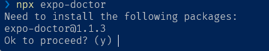

# Get started

## 1. Local Development Environment

### 1.1 Verify Node.js Installation

To verify the installation and working of Node.js and npm on your system, you can use the following commands in your terminal:

```bash
node -v
v18.18.2

npm -v
9.8.1

npx --version
9.8.1
```

### 1.2 Create new expo project using `npx command`

```bash
npx create-expo-app project-name
```


### 1.3 Starting the project

```bash
// Start a server for developing your app:
npx expo start
```


> Note that the **open web** option is inactive


Install `react-native-web@~0.19.6`, `react-dom@18.2.0`, `@expo/webpack-config@^19.0.0` by running:

```bash
npx expo install react-native-web@~0.19.6 react-dom@18.2.0 @expo/webpack-config@^19.0.0
```

> Note: this command may be changed, or different base on the running version of expo


### 1.4 Install and update packages

```bash
// Install and update packages that work with the version of react-native in the project:
npx expo install package-name
```

### 1.5 Exploring the project


- **package.json**
  - This file is a standard part of **Node.js** projects. It lists the project's dependencies, scripts, and other metadata.
  - dependencies and devDependencies sections list the packages used in the project.
- **.babel.config.js**
  - This file is used to configure Babel, which is a JavaScript compiler. It allows you to use the latest JavaScript features and compile them to a version that is compatible with older devices and browsers.
  - It may include presets and plugins for Babel transformations.
- **app.json**
  - The `app.json` file is specific to Expo projects. It contains project configuration settings, such as the name, version, and various settings for the Expo client and build process.
- **App.js**
  - This is the main entry point for your Expo app. It typically contains the root component of your app. You can modify this file to define the structure of your app.
- **assets folder**
  - The assets folder is where you can store static assets like images, fonts, and other files that are part of your app's user interface.
  - Expo provides a convenient way to reference assets in your code.
- **node_modules folder**
  - This is the folder where all the project's dependencies are installed. It contains third-party libraries and modules used in your project.

### 1.6 Diagnose issues with the project

```bash
npx expo-doctor
```




## 2. Online Emulator

- Visit [Expo](https://snack.expo.io/) site, and register for login.
- After registration and logging, you will be able to develop expo app online using [Expo Snack](https://snack.expo.io/)
- It is an online emulator to develop React Native app.
- It is possible to make a whole app in the online emulator.
- You can also see the real-time changes in the online emulator.


