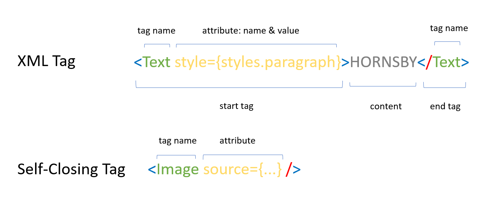
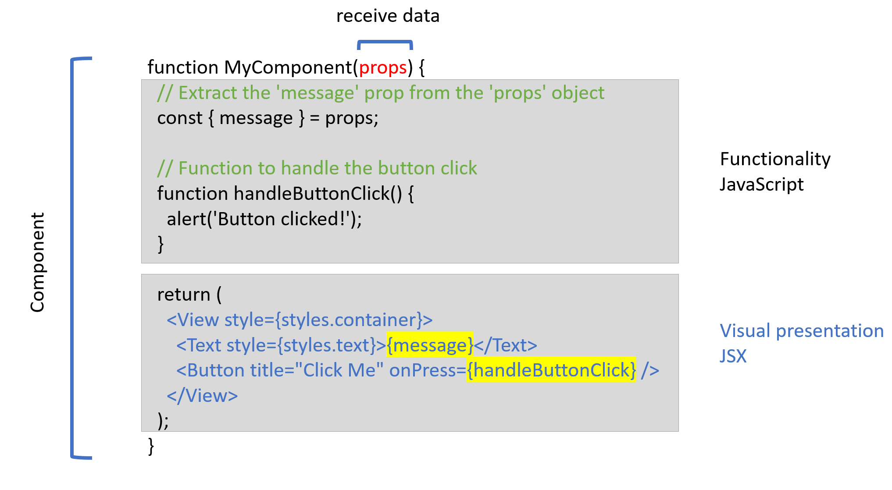

# Introduction to JSX and Component in React Native

## JSX in React Native

**JSX (JavaScript XML)** is an extension of JavaScript used with React-native to describe the structure of user interfaces in a syntax that closely resembles XML or HTML.



### JSX Key Points

- **Tags**: JSX uses tags that resemble HTML elements. Tags are used to represent React Native components, and they must **start with a capital letter**
- **Self-Closing Tags**: Just like in HTML, JSX allows for self-closing tags for elements that **don't have children**.
- It allows developers to define the appearance and structure of components by writing markup within JavaScript code.
- JSX allows you to embed JavaScript expressions within curly braces `{}`. This allows for dynamic content and the execution of JavaScript code within the markup.
- JSX code must be transpiled into plain JavaScript before it can be executed in a browser or a JavaScript runtime. Tools like Babel are commonly used for this purpose.

```javascript
import { Text, SafeAreaView, StyleSheet } from 'react-native';

export default function App() {
  return (
    <SafeAreaView style={styles.container}>
      <Text style={styles.paragraph}>HORNSBY</Text>
      <button style={styles.btn}>OK</button>
    </SafeAreaView>
  );
}

const styles = StyleSheet.create({
  container: {
    flex: 1,
    justifyContent: 'center',
    backgroundColor: '#ecf0f1',
    padding: 8,
  },
  paragraph: {
    margin: 24,
    fontSize: 18,
    fontWeight: 'bold',
    textAlign: 'center',
  },
  btn: {
    margin: 44,
    fontSize: 18,
    fontWeight: 'bold',
    textAlign: 'center',
  },
});
```

## Component in React Native

A component in React Native is a fundamental building block used to create user interfaces for mobile applications. Components are the core concept in React Native and enable developers to create dynamic, modular, and maintainable mobile apps



### Component Key Points

- **Reusable and Modular**: Components are designed to be reusable, making it easy to create complex user interfaces by composing smaller, self-contained building blocks.
- **Encapsulation**: Components encapsulate both the visual presentation (using JSX) and the functionality (using JavaScript) related to a specific part of the user interface.
- **Hierarchical Structure**: React Native apps are typically organized hierarchically, with components nested within other components to create the app's structure.
- **State and Props**: Components can have their own state (internal data) and receive data through **props** (properties) from parent components.
- **Lifecycle Methods**: Components have lifecycle methods that allow developers to control and respond to various stages in a component's existence, such as when it's mounted, updated, or unmounted.
- **Customization**: Developers can create custom components tailored to their app's specific needs or use built-in components from React Native's library.
- **Performance Optimization**: Properly designed components can help optimize app performance and facilitate code maintainability.
- **Root Component**: Every React Native app typically has a single root component that serves as the entry point for the application.
- **Single Root Element**: In JSX, there must be a single root element that wraps all other elements
- **Props**: You can pass data and configuration to components using props. These are passed as attributes in JSX tags and can be accessed within the component as properties
- **JavaScript Expressions**: You can use curly braces **{}** to insert JavaScript expressions and variables within JSX tags. This allows for dynamic content and logic.

```javascript
import React from 'react';
import { TouchableOpacity, Text, StyleSheet } from 'react-native';

const CustomButton = ({ title, onPress, buttonStyle, textStyle }) => {
  return (
    <TouchableOpacity style={[styles.button, buttonStyle]} onPress={onPress}>
      <Text style={[styles.buttonText, textStyle]}>{title}</Text>
    </TouchableOpacity>
  );
};

const styles = StyleSheet.create({
  button: {
    backgroundColor: 'blue',
    padding: 10,
    borderRadius: 5,
    alignItems: 'center',
  },
  buttonText: {
    color: 'white',
    fontSize: 16,
    fontWeight: 'bold',
  },
});

export default CustomButton;
```

The component is exported and can be used in other parts of your React Native app. For example, you can use it like this:

```jsx
<CustomButton
  title="Click Me"
  onPress={() => {
    // Your custom logic here when the button is pressed.
  }}
  buttonStyle={{ backgroundColor: 'green' }}
  textStyle={{ color: 'white' }}
/>
```

### Components Types

| Component Type                | Description                                                                                    |
| ----------------------------- | ---------------------------------------------------------------------------------------------- |
| Native Modules Representation | Components that provide access to native modules and device capabilities.                      |
| Screen or Page Components     | Components representing full-screen views or screens within the mobile app.                    |
| Customized Components         | Custom components created to encapsulate UI elements with custom styling and behavior.         |
| Compound Components           | A collection of related components meant to be used together.                                  |
| Form Components               | Components designed for collecting and validating user input in forms.                         |
| List Components               | Components for displaying lists of data or items efficiently.                                  |
| Navigation Components         | Components facilitating user navigation between screens or sections of the app.                |
| Modal Components              | Components that create overlay views on top of the current screen, such as pop-up dialogs.     |
| UI Control Components         | Interactive user interface elements like buttons, sliders, switches, and touchable components. |
| UI Layout Components          | Components for defining the structure and arrangement of elements on a screen.                 |
